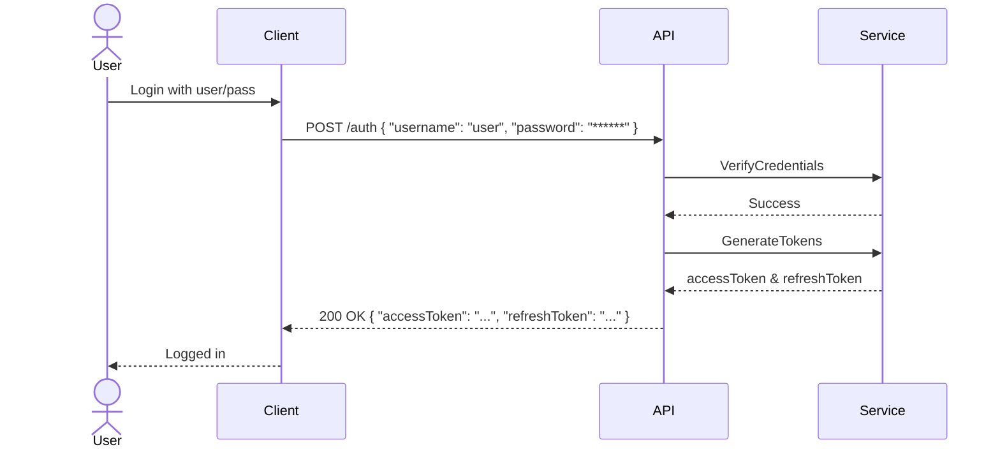
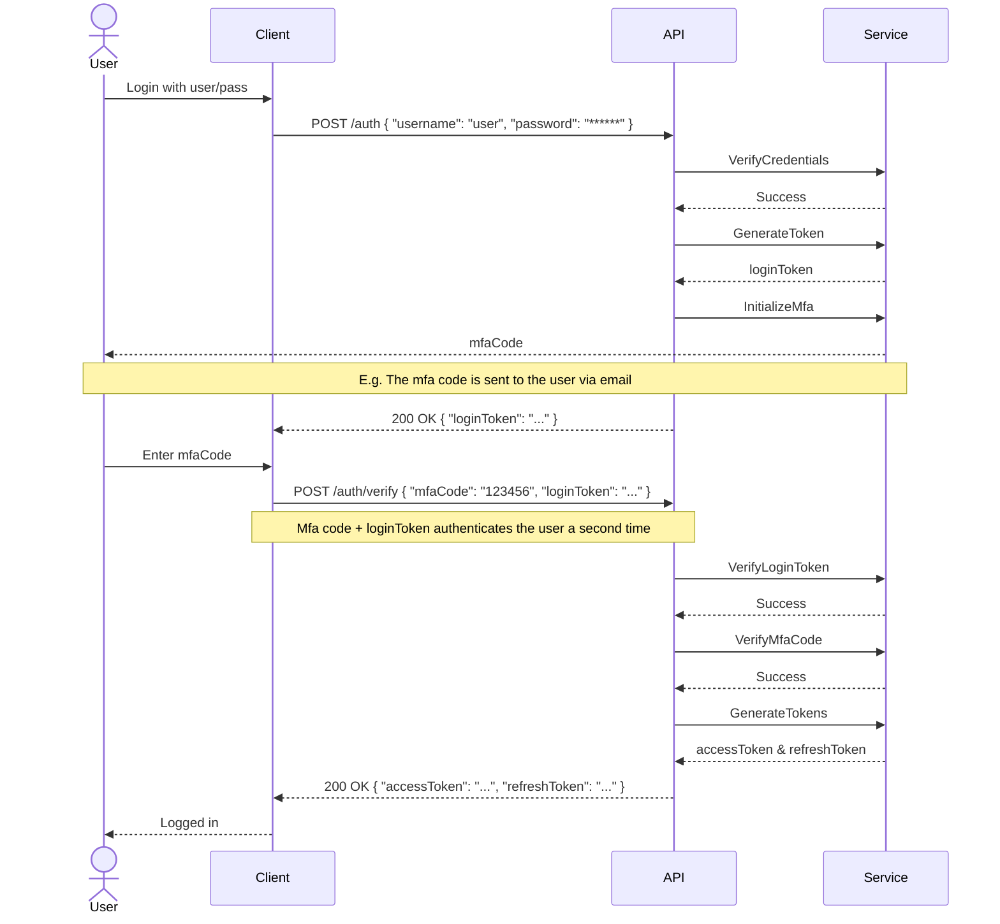

# Endpoints for the Wholesale Module and New Geins Studio

## Auth Service

### Endpoints

| Verb | Payload                             | Path               | Response                      | Req. `x-account-key` |
| ---- | ----------------------------------- | ------------------ | ----------------------------- | -------------------- |
| POST | [`Credentials`](#credentials)       | `/v2/auth`         | [`JwtResponse`](#jwtresponse) | -                    |
| POST | [`MfaCredentials`](#mfacredentials) | `/v2/auth/verify`  | [`JwtResponse`](#jwtresponse) | -                    |
| POST | [`RefreshToken`](#refreshtoken)     | `/v2/auth/refresh` | [`JwtResponse`](#jwtresponse) | -                    |
| GET  | -                                   | `/v2/auth/ping`    | HTTP 204                      | -                    |

### Request Models

#### Credentials

The authentication credentials used for the initial authentication request.

| Type     | Name     | Example            | Description    |
| -------- | -------- | ------------------ | -------------- |
| `string` | username | `'user@email.com'` | User username. |
| `string` | password | `'******'`         | User password. |

#### MfaCredentials

The mfa authentication credentials used for the secondary authentication verification request.

| Type     | Name       | Example    | Description                                                           |
| -------- | ---------- | ---------- | --------------------------------------------------------------------- |
| `string` | loginToken | `'eyJ...'` | The `loginToken` received from a previous auth-request.               |
| `string` | mfaCode    | `'12345'`  | The MFA code sent to or generated by the user via an external method. |

#### RefreshToken

| Type     | Name         | Example    | Description                                                               |
| -------- | ------------ | ---------- | ------------------------------------------------------------------------- |
| `string` | refreshToken | `'abc...'` | A valid refresh token received from a previous successful authentication. |

### Response Models

#### JwtResponse

The response received from all successful authentication, verification and refresh requests.

| Type                            | Name         | Example    | Description                                                                                               |
| ------------------------------- | ------------ | ---------- | --------------------------------------------------------------------------------------------------------- |
| `bool`                          | mfaRequired  | `true`     | If this authentication attempt requires additional verification with MFA.                                 |
| `string`                        | mfaMethod    | `'email'`  | The method used for verification if MFA is required.                                                      |
| `string`                        | loginToken   | `'eyJ...'` | The login token used for verification if MFA is required.                                                 |
| `string`                        | accessToken  | `'eyJ...'` | A new access token granted upon successful authentication or refresh. Will be absent if MFA is required.  |
| `string`                        | refreshToken | `'abc...'` | A new refresh token granted upon successful authentication or refresh. Will be absent if MFA is required. |
| [`AuthAccount[]`](#authaccount) | accounts     | -          | All account keys and display names that the authenticated user has access to.                             |

##### AuthAccount

Account keys and display names that an authenticated user has access to.

| Type     | Name        | Example                                  | Description                      |
| -------- | ----------- | ---------------------------------------- | -------------------------------- |
| `string` | accountKey  | `'9fda180b-f657-4dfa-bb67-f23da9f602a2'` | The account key of the account.  |
| `string` | displayName | `'Store Corp'`                           | The display name of the account. |

### SFA Sequence diagram



### MFA Sequence diagram



## User Service

### Endpoints

| Verb   | Payload                               | Path                                                | Response        | Req. `x-account-key` |
| ------ | ------------------------------------- | --------------------------------------------------- | --------------- | -------------------- |
| GET    | -                                     | `/v2/user/<username:string>`                        | [`User`](#user) | &check;              |
| GET    | -                                     | `/v2/user/me`                                       | [`User`](#user) | &check;              |
| GET    | -                                     | `/v2/user/list`                                     | [`User`](#user) | &check;              |
| POST   | [`UserRequest`](#userrequest)         | `/v2/user`                                          | -               | &check;              |
| PUT    | [`UserRequest`](#userrequest)         | `/v2/user/<username>`                               | -               | &check;              |
| DELETE | -                                     | `/v2/user/<username:string>`                        | -               | &check;              |
| POST   | [`UserRoleRequest`](#userrolerequest) | `/v2/user/<username>/role`                          | -               | &check;              |
| DELETE | -                                     | `/v2/user/<username:string>/role/<rolename:string>` | -               | &check;              |

### Request Models

#### UserRequest

Model for a request to create or update a user.  
All fields are required for both update and create, with the exception of password when updating.

| Type     | Name        | Example                  | Description                                                                                                                                                    |
| -------- | ----------- | ------------------------ | -------------------------------------------------------------------------------------------------------------------------------------------------------------- |
| `string` | username    | `'john.doe@email.com'`   | The username of the user. Will change the username of an existing user to this value. Has to be unique within the same account.                                |
| `string` | password    | `'******'`               | The password of the user.                                                                                                                                      |
| `string` | apiUserType | `'api'`                  | The type of user. Valid values are `api` or `personal`. Different types have different default access policies.                                                |
| `string` | email       | `'johndoe123@email.com'` | The email of the user. Often the same value as the username, but doesn't have to be. Email communication will be sent to this address, including MFA requests. |
| `string` | phoneNumber | `'+46123456789'`         | The phone number of the user.                                                                                                                                  |
| `string` | firstName   | `'John'`                 | The first name of the user.                                                                                                                                    |
| `string` | lastName    | `'Doe'`                  | The last name of the user.                                                                                                                                     |

#### UserRoleRequest

| Type     | Name     | Example     | Description    |
| -------- | -------- | ----------- | -------------- |
| `string` | roleName | `'Manager'` | The role name. |

### Response Models

#### User

An API user.  
A user can authenticate against the API and receive an access token. Most endpoints in the API require that the request includes an access token.

| Type     | Name        | Example                  | Description                                                                                                                                                    |
| -------- | ----------- | ------------------------ | -------------------------------------------------------------------------------------------------------------------------------------------------------------- |
| `string` | username    | `'john.doe@email.com'`   | The username of the user. This is used for authentication.                                                                                                     |
| `string` | apiUserType | `'api'`                  | The type of user. Valid values are `api` or `personal`. Different types have different default access policies.                                                |
| `string` | email       | `'johndoe123@email.com'` | The email of the user. Often the same value as the username, but doesn't have to be. Email communication will be sent to this address, including MFA requests. |
| `string` | phoneNumber | `'+46123456789'`         | The phone number of the user.                                                                                                                                  |
| `string` | firstName   | `'John'`                 | The first name of the user.                                                                                                                                    |
| `string` | lastName    | `'Doe'`                  | The last name of the user.                                                                                                                                     |

## Account Service

### Endpoints

| Verb | Payload | Path                                                                          | Response                  | Req. `x-account-key` |
| ---- | ------- | ----------------------------------------------------------------------------- | ------------------------- | -------------------- |
| GET  | -       | `/v2/account`                                                                 | [`Account`](#account)     | &check;              |
| GET  | -       | `/v2/account/list`                                                            | [`Account`](#account)     | -                    |
| GET  | -       | `/v2/account/channel/<channelId:int>`                                         | [`Channel`](#channel)     | &check;              |
| GET  | -       | `/v2/account/channel/list`                                                    | [`Channel[]`](#channel)   | &check;              |
| GET  | -       | `/v2/account/market/<marketId:int>`                                           | [`Market`](#market)       | &check;              |
| GET  | -       | `/v2/account/market/list` <br/> `/v2/account/channel/<channelid>/market/list` | [`Market[]`](#market)     | &check;              |
| GET  | -       | `/v2/account/country/<countryId:string>`                                      | [`Country`](#country)     | &check;              |
| GET  | -       | `/v2/account/country/list`                                                    | [`Country[]`](#country)   | &check;              |
| GET  | -       | `/v2/account/language/<languageId:string>`                                    | [`Language`](#language)   | &check;              |
| GET  | -       | `/v2/account/language/list`                                                   | [`Language[]`](#language) | &check;              |
| GET  | -       | `/v2/account/currency/<currencyId:string>`                                    | [`Currency`](#currency)   | &check;              |
| GET  | -       | `/v2/account/currency/list`                                                   | [`Currency[]`](#currency) | &check;              |
| GET  | -       | `/v2/account/ping`                                                            | HTTP 204                  | -                    |

### Response Models

All names are defined in English.

#### Account

An account is required for a merchant to be able to use the API.  
The account encapsulates all users, channels and so forth.

| Type     | Name            | Example                                  | Description                                                                     |
| -------- | --------------- | ---------------------------------------- | ------------------------------------------------------------------------------- |
| `string` | name            | `'store corp'`                           | The name of the account. Usually the same as the merchant.                      |
| `string` | displayName     | `'Store Corp'`                           | The display name of the account.                                                |
| `string` | accountKey      | `'9fda180b-f657-4dfa-bb67-f23da9f602a2'` | The account key of the account. This is required in most API requests.          |
| `string` | defaultCurrency | `'SEK'`                                  | The default currency of the merchant. This is used in all currency conversions. |

#### Channel

A sales channel.
This represents a logically distinct "space" where sales takes place, eg a webshop or a physical store.  
Every merchant has at least one channel.

| Type                      | Name          | Example                              | Description                                                                           |
| ------------------------- | ------------- | ------------------------------------ | ------------------------------------------------------------------------------------- |
| `int`                     | id            | `1`                                  | Unique identifier for the channel                                                     |
| `string`                  | name          | `'online-store-foo-123'`             | The internal name of the channel. This value should not be used for display purposes. |
| `string`                  | displayName   | `'Online Store'`                     | The display name of the channel.                                                      |
| `string`                  | location      | `'www.store.com'` or `'123 Main St'` | The location of the channel if applicable. Eg a URL or a physical address.            |
| `string`                  | type          | `'webshop'`                          | The type of channel. Valid values are `webshop`, `physical` or `other`.               |
| `bool`                    | active        | `true`                               | If this channel is active or not.                                                     |
| [`Market[]`](#market)     | markets       | -                                    | The markets that are valid for this channel.                                          |
| `int`                     | defaultMarket | `10`                                 | The id of the default market for this channel.                                        |
| [`Language[]`](#language) | languages     | -                                    | The languages that are valid for this channel.                                        |

#### Market

A market within a sales channel.  
Each market is defined by a country-currency combo and defines which languages are valid within that market.  
Markets are central for localization, pricing, region preference and shipping selection.

| Type                    | Name             | Example                     | Description                                                                                                                                                        |
| ----------------------- | ---------------- | --------------------------- | ------------------------------------------------------------------------------------------------------------------------------------------------------------------ |
| `int`                   | id               | `10`                        | The identifier for the market. This id is unique across all channels.                                                                                              |
| `int`                   | channelId        | `1`                         | The channel id that this market belongs to.                                                                                                                        |
| [`Country`](#country)   | country          | -                           | The country of this market. _Note:_ If the market is **Virtual**, then this value does not define an actual country.                                               |
| [`Currency`](#currency) | currency         | -                           | The currency of the market.                                                                                                                                        |
| `bool`                  | virtual          | `true`                      | True if this market doesn't target a specific country but rather a virtual region of some sort, eg `EU`.                                                           |
| `string[]`              | attributes       | `['OnlyDisplayInCheckout']` | Attributes that this market has, if any.                                                                                                                           |
| `string[]`              | allowedLanguages | `['sv', 'en']`              | The language ids that are valid for this market. See channel languages collection for language details.                                                            |
| `string`                | defaultLanguage  | `'sv'`                      | The id of the default language for this market.                                                                                                                    |
| `string`                | group            | `'europe'`                  | The group that this market belongs to, if any.                                                                                                                     |
| `bool`                  | active           | `true`                      | If this market is active or not. _Note:_ If either **Currency** or **Country** is inactive then the market is effectively also inactive, regardless of this value. |

#### Country

A country.  
Country is used within markets and are central for region preferences and shipping.

| Type     | Name   | Example    | Description                                                                                        |
| -------- | ------ | ---------- | -------------------------------------------------------------------------------------------------- |
| `string` | id     | `'SE'`     | The unique identifier for the country. This is the 2-letter ISO 3166-1 alpha-2 code, eg `SE`.      |
| `string` | name   | `'Sweden'` | The English name of the country.                                                                   |
| `bool`   | active | `true`     | If this country is active or not. _Note:_ This will also affect **Markets** that use this country. |

#### Language

A language.  
Language is central for localization and navigation.

| Type     | Name   | Example     | Description                                                                           |
| -------- | ------ | ----------- | ------------------------------------------------------------------------------------- |
| `string` | id     | `'sv'`      | The unique identifier for the language. This is the 2-letter ISO 639-1 code, eg `sv`. |
| `string` | name   | `'Swedish'` | The English name of the language.                                                     |
| `bool`   | active | `true`      | If this language is active or not.                                                    |

#### Currency

A currency.  
Currency is used within markets for pricing.

| Type                                | Name           | Example           | Description                                                                                                                     |
| ----------------------------------- | -------------- | ----------------- | ------------------------------------------------------------------------------------------------------------------------------- |
| `string`                            | id             | `'SEK'`           | The unique identifier for the currency. This is the 3-letter ISO 4217 code, eg `SEK`.                                           |
| `string`                            | name           | `'Swedish Krona'` | The English name of the currency.                                                                                               |
| [`CurrencySymbol`](#currencysymbol) | symbol         | -                 | Symbol details of the currency.                                                                                                 |
| `decimal`                           | conversionRate | `10.24`           | The conversion rate to this currency from the default currency. The default currency is defined under on the owner **Account**. |

#### CurrencySymbol

Symbol details of a currency.

| Type     | Name     | Example | Description                                                                                                                            |
| -------- | -------- | ------- | -------------------------------------------------------------------------------------------------------------------------------------- |
| `string` | value    | `'$'`   | The symbol value. Eg `$` for USD or `kr` for SEK.                                                                                      |
| `bool`   | prefixed | `false` | If the symbol is placed before the monetary value when displaying a price. Eg `true` for USD in "$100" and `false` for SEK in "100kr". |

## Wholesale Service

### Endpoints

| Verb | Payload | Path                                                                                                       | Response                                  | Req. `x-account-key` |
| ---- | ------- | ---------------------------------------------------------------------------------------------------------- | ----------------------------------------- | -------------------- |
| GET  | -       | `/v2/api/wholesale/account/<wholesaleAccountId:int>`                                                       | [`WholesaleAccount`](#wholesaleaccount)   | &check;              |
| GET  | -       | `/v2/api/wholesale/account/list`                                                                           | [`WholesaleAccount[]`](#wholesaleaccount) | &check;              |
| GET  | -       | `/v2/api/wholesale/accountgroup/list`                                                                      | `string[]`                                | &check;              |
| GET  | -       | `/v2/api/wholesale/accountaddress/<wholesaleAccountAddressId:int>`                                         | [`Address`](#wholesaleaccountaddress)     | &check;              |
| GET  | -       | `/v2/api/wholesale/account/<wholesaleAccountId:int>/address/list`                                          | [`Address[]`](#wholesaleaccountaddress)   | &check;              |
| GET  | -       | `/v2/api/wholesale/buyer/<buyerId:int>`                                                                    | [`Buyer`](#buyer)                         | &check;              |
| GET  | -       | `/v2/api/wholesale/buyer/list` <br/> `/v2/api/wholesale/account/<wholesaleAccountId:int>/buyer/list`       | [`Buyer[]`](#buyer)                       | &check;              |
| GET  | -       | `/v2/api/wholesale/salesrep/<salesrepId:int>`                                                              | [`SalesRep`](#salesrep)                   | &check;              |
| GET  | -       | `/v2/api/wholesale/salesrep/list` <br/> `/v2/api/wholesale/account/<wholesaleAccountId:int>/salesrep/list` | [`SalesRep[]`](#salesrep)                 | &check;              |

### Response Models

#### WholesaleAccount

_Note: Not to be confused with the Account model under the Account API._

A wholesale account refers to a business entity that purchases goods or services from a merchant within the Geins platform.

| Type                                    | Name       | Example                            | Description                                                                                     |
| --------------------------------------- | ---------- | ---------------------------------- | ----------------------------------------------------------------------------------------------- |
| `int`                                   | id         | `100`                              | The unique identifier for the wholesale account.                                                |
| `string`                                | name       | `'ACME Corp'`                      | The name of the wholesale account.                                                              |
| `string`                                | vatNumber  | `'556677-8899'`                    | The vat number of the wholesale account.                                                        |
| `string`                                | externalId | `'EXT123'`                         | The external identifier for the wholesale account, if any.                                      |
| `int[]`                                 | channels   | `[1, 2, 3]`                        | The sales channels that the wholesale account can manage.                                       |
| `string[]`                              | tags       | `['vip', '2024', 'group:Primary']` | Any custom tags that are associated with the wholesale account.                                 |
| `string[]`                              | groups     | `['Primary']`                      | The groups that the wholesale account is a member of. Groups are tags prefixed with `'group:'`. |
| `string`                                | meta       | `'{"customField": "value"}'`       | Any additional metadata that is associated with the wholesale account.                          |
| [`Address[]`](#wholesaleaccountaddress) | addresses  |                                    | The addresses associated with the wholesale account.                                            |

#### Address

Represents address details of a wholesale account.

| Type     | Name          | Example                 | Description                  |
| -------- | ------------- | ----------------------- | ---------------------------- |
| `int`    | accountId     | `100`                   | The account identifier.      |
| `int`    | addressId     | `5678`                  | The address identifier.      |
| `string` | email         | `'contact@company.com'` | The email address.           |
| `string` | phone         | `'+46701234567'`        | The phone number.            |
| `string` | company       | `'ACME Corp'`           | The company name.            |
| `string` | firstName     | `'John'`                | The first name.              |
| `string` | lastName      | `'Smith'`               | The last name.               |
| `string` | careOf        | `'c/o Jane Doe'`        | The care of information.     |
| `string` | addressLine1  | `'123 Main St'`         | The first address line.      |
| `string` | addressLine2  | `'Suite 100'`           | The second address line.     |
| `string` | addressLine3  | `'Building A'`          | The third address line.      |
| `string` | zip           | `'12345'`               | The zip code.                |
| `string` | city          | `'Miami'`               | The city.                    |
| `string` | region        | `'Florida'`             | The region.                  |
| `int`    | countryId     | `8`                     | The country identifier.      |
| `string` | country       | `'USA'`                 | The country name.            |
| `int`    | addressTypeId | `1`                     | The address type identifier. |
| `string` | addressType   | `'Billing'`             | The address type.            |

#### SalesRep

A wholesale sales representative is tied to a merchant and acts as the intermediary between the merchant and its wholesale accounts.

| Type     | Name       | Example                    | Description                                                                        |
| -------- | ---------- | -------------------------- | ---------------------------------------------------------------------------------- |
| `int`    | id         | `201`                      | The unique identifier for the wholesale sales representative.                      |
| `string` | firstName  | `'John'`                   | The first name of the wholesale sales representative.                              |
| `string` | lastName   | `'Smith'`                  | The last name of the wholesale sales representative.                               |
| `string` | email      | `'john.smith@company.com'` | The email address of the wholesale sales representative.                           |
| `string` | phone      | `'+46701234567'`           | The phone number of the wholesale sales representative.                            |
| `int[]`  | accountIds | `[100, 101, 102]`          | The wholesale accounts that the wholesale sales representative is associated with. |

#### Buyer

A buyer is an individual or entity that purchases goods or services from a merchant within the Geins ecosystem.  
They are the end users of the product or service offered, operating either on behalf of themselves or as authorized representatives of an account.

| Type     | Name      | Example                          | Description                                                                                  |
| -------- | --------- | -------------------------------- | -------------------------------------------------------------------------------------------- |
| `int`    | id        | `3001`                           | The unique identifier for the wholesale buyer.                                               |
| `string` | firstName | `'Barbara'`                      | The first name of the wholesale buyer.                                                       |
| `string` | lastName  | `'Anderson'`                     | The last name of the wholesale buyer.                                                        |
| `string` | email     | `'barbara.anderson@company.com'` | The email address of the wholesale buyer.                                                    |
| `string` | phone     | `'+46702345678'`                 | The phone number of the wholesale buyer.                                                     |
| `int`    | accountId | `100`                            | The unique identifier for the wholesale account that the wholesale buyer is associated with. |

## Product Service

### Endpoints

| Verb | Payload                                     | Path                                          | Query                                                                                                | Response                                      | Req. `x-account-key` |
| ---- | ------------------------------------------- | --------------------------------------------- | ---------------------------------------------------------------------------------------------------- | --------------------------------------------- | -------------------- |
| GET  | -                                           | `/v2/api/product/<productId:int>`             | [`fields`](#productfieldsfilter), [`currencies`](#currenciesfilter), [`languages`](#languagesfilter) | [`Product`](#product)                         | &check;              |
| POST | [`ProductBatchQuery`](#productbatchquery)   | `/v2/api/product/query`                       | [`fields`](#productfieldsfilter), [`currencies`](#currenciesfilter), [`languages`](#languagesfilter) | [`ProductBatchResult`](#productbatchresult)   | &check;              |
| GET  | -                                           | `/v2/api/product/brand/<brandId:int>`         | -                                                                                                    | [`Brand`](#brand)                             | &check;              |
| POST | [`BrandBatchQuery`](#brandbatchquery)       | `/v2/api/product/brand/query`                 | -                                                                                                    | [`BrandBatchResult`](#brandbatchresult)       | &check;              |
| GET  | -                                           | `/v2/api/product/category/<categoryId:int>`   | -                                                                                                    | [`Category`](#category)                       | &check;              |
| POST | [`CategoryBatchQuery`](#categorybatchquery) | `/v2/api/product/category/query`              | -                                                                                                    | [`CategoryBatchResult`](#categorybatchresult) | &check;              |
| GET  | -                                           | `/v2/api/product/pricelist/<pricelistId:int>` | [`fields`](#pricelistfieldsfilter)                                                                   | [`PriceList`](#pricelist)                     | &check;              |
| GET  | -                                           | `/v2/api/product/pricelist/list`              | [`fields`](#pricelistfieldsfilter)                                                                   | [`PriceList[]`](#pricelist)                   | &check;              |

### Request Models

#### Fields (Product) {#productfieldsfilter}

Query parameter for including optional [`Product`](#product) fields.

Accepts a comma-separated list of any of the following values:
| Value | Included fields |
|-------|-------------|
| `default` | **Skus** & **Prices**. |
| `texts` | **Texts** under **Products**, **Categories** & **Parameters**. Requires that the parent field is also included.<br/>See [languages filter](#languagesfilter) for additional filter options. |
| `skus` | **Skus**. |
| `sort` | **Sort**. |
| `prices` | **Prices**. See [currency filter](#currenciesfilter) for additional filter options. |
| `pricelists` | **PriceLists** under **Prices**. Requires that **Prices** is also included. |
| `categories` | **Categories**. |
| `channels` | **Channels**. |
| `images` | **Images**. |
| `languages` | **Languages**. |
| `campaigns` | **Campaigns**. |
| `parameters` | **Parameters**. |
| `relatedproducts` | **RelatedProducts**. |
| `variantvalues` | **VariantValues**. |
| `all` | _All_ optional fields. Should only be used if absolutely necessary. |

#### Currencies {#currenciesfilter}

Query parameter for limiting price data to a certain currency in a [`Product`](#product) response.  
Accepts a comma-separated list of 3-letter currency codes. If set, will remove any prices in the result that are not of any of the currencies set in the currency filter.

#### Languages {#languagesfilter}

Query parameter for limiting text responses to a certain language in a [`Product`](#product) response.  
Accepts a comma-separated list of 2-letter language codes. If set, will remove any texts in the result with a language other than those set in the language filter.

#### Fields (PriceList) {#pricelistfieldsfilter}

Query parameter for including optional [`PriceList`](#pricelist) fields.

Accepts a comma-separated list of any of the following values:
| Value | Included fields |
|-------|-------------|
| `default` | No optional fields. |
| `products` | **Products**. |
| `all` | All optional fields. |

#### BatchQuery

Base model for batch queries.

Make sure to include the **batchId** retrieved from the initial query when doing subsequent page queries.

| Type   | Name     | Example                                  | Description                                                                                |
| ------ | -------- | ---------------------------------------- | ------------------------------------------------------------------------------------------ |
| `guid` | batchId  | `'1ce02220-7a6e-4fe2-8b15-775cecbfb397'` | The batch id to continue querying subsequent pages on. Will create a new batch if omitted. |
| `int`  | page     | `2`                                      | The page to retrive from the batch. Defaults to 1.                                         |
| `int`  | pageSize | `100`                                    | The number of items that each page contains. Max is 1000. Defaults to 1000.                |

#### ProductBatchQuery

A query for products.

See the base model [`BatchQuery`](#batchquery) for additional fields.

| Type                                  | Name    | Example | Description                                                                                                    |
| ------------------------------------- | ------- | ------- | -------------------------------------------------------------------------------------------------------------- |
| [`SelectionGroup[]`](#selectiongroup) | include | -       | Groups of selections to include in the result.                                                                 |
| [`SelectionGroup[]`](#selectiongroup) | exclude | -       | Groups of selections to exclude from the result. Exclude removes results from Include.                         |
| `bool`                                | all     | `true`  | Matches _all_ products. Use this to retrieve all products. Cannot be combined with **include** or **exclude**. |

##### Examples

All products:

```
{
    "all": true
}
```

All products from a certain brand that are in stock:

```
{
    "include": [
        {
            "selections": [
                {
                    "condition": "and",
                    "brandIds": [
                        1
                    ],
                    "stock": [
                        {
                            "condition": "gt",
                            "quantity": 0
                        }
                    ]
                }
            ]
        }
    ]
}
```

Page 2 of a certain query:

```
{
    "batchId": "3a69abd3-df70-42f3-ae75-4e0f224dbac9",
    "page": 2
}
```

##### SelectionGroup

Represents a group of selections.

Each group consists of one or many [Selections](#selection) that are combined according to the [`SelectorCondition`](#selectorcondition).

| Type                                      | Name       | Example | Description                                                                                          |
| ----------------------------------------- | ---------- | ------- | ---------------------------------------------------------------------------------------------------- |
| [`SelectorCondition`](#selectorcondition) | condition  | `'or'`  | The condition for the selections in the selection group. Can be omitted and then defaults to `'or'`. |
| [`Selection[]`](#selection)               | selections | -       | The selections within this group.                                                                    |

##### Selection

Represents a selection criteria.

A selection criteria consists of one or many sub-selections that target certain fields or properties on products. These are combined according to the [`SelectorCondition`](#selectorcondition).

| Type                                      | Name        | Example | Description                                                                                         |
| ----------------------------------------- | ----------- | ------- | --------------------------------------------------------------------------------------------------- |
| [`SelectorCondition`](#selectorcondition) | condition   | `'and'` | The condition for the sub-selections in the selection. Can be omitted and then defaults to `'and'`. |
| `int[]`                                   | productIds  | -       | Matches _any_ product ids.                                                                          |
| `int[]`                                   | brandIds    | -       | Matches _any_ brand ids.                                                                            |
| `int[]`                                   | categoryIds | -       | Matches _any_ category ids.                                                                         |
| [`PriceSelection[]`](#priceselection)     | price       | -       | Price selection criteria.                                                                           |
| [`StockSelection[]`](#stockselection)     | stock       | -       | Stock selection criteria.                                                                           |

##### PriceSelection

Represents price selection criteria.

| Type                                    | Name      | Example                         | Description                                                      |
| --------------------------------------- | --------- | ------------------------------- | ---------------------------------------------------------------- |
| [`CompareCondition`](#comparecondition) | condition | `'lt'`                          | The condition for the price selection.                           |
| `Dictionary<string, decimal>`           | values    | `{ "SEK": 200.0, "EUR": 20.0 }` | The values for the price selection. Matches _any_ of the values. |

##### StockSelection

Represents stock selection criteria.

| Type                                    | Name      | Example | Description                            |
| --------------------------------------- | --------- | ------- | -------------------------------------- |
| [`CompareCondition`](#comparecondition) | condition | `'gt'`  | The condition for the stock selection. |
| `int`                                   | quantity  | `10`    | The quantity for the stock selection.  |

##### SelectorCondition

Condition for multiple selections.

| Value   | Description                           |
| ------- | ------------------------------------- |
| `'and'` | Only true if all selections are true. |
| `'or'`  | True if any selection is true.        |

##### CompareCondition

Condition for value comparison.

| Value  | Description   |
| ------ | ------------- |
| `'lt'` | Less than.    |
| `'eq'` | Equals.       |
| `'gt'` | Greater than. |

#### BrandBatchQuery

A batch query for brands.

See the base model [`BatchQuery`](#batchquery) for additional fields.

| Type    | Name     | Example   | Description                                            |
| ------- | -------- | --------- | ------------------------------------------------------ |
| `int[]` | brandIds | `[1,2,3]` | Matches any of the brand ids provided.                 |
| `all`   | bool     | true      | Matches _all_ brands. Use this to retrieve all brands. |

#### CategoryBatchQuery

A batch query for categories.

See the base model [`BatchQuery`](#batchquery) for additional fields.

| Type    | Name        | Example      | Description                                                    |
| ------- | ----------- | ------------ | -------------------------------------------------------------- |
| `int[]` | categoryIds | `[10,22,30]` | Matches any of the category ids provided.                      |
| `all`   | bool        | true         | Matches _all_ categories. Use this to retrieve all categories. |

### Response Models

#### BatchResult

A result that only includes a subset of items from a potentially larger batch of items. Each subset is called a **page**.

By using the same **batchId** when querying, one can iterate each page one by one within the same batch.  
This enables handling of large data sets without having to load everything at once.

| Type   | Name           | Example                                  | Description                                                                                                                                                                       |
| ------ | -------------- | ---------------------------------------- | --------------------------------------------------------------------------------------------------------------------------------------------------------------------------------- |
| `guid` | batchId        | `'1ce02220-7a6e-4fe2-8b15-775cecbfb397'` | The id for the batch result.                                                                                                                                                      |
| `int`  | page           | `1`                                      | The current page of the batch result.                                                                                                                                             |
| `int`  | pageSize       | `1000`                                   | The size of each page.                                                                                                                                                            |
| `int`  | totalItemCount | `13812`                                  | The total amount of items in the entire batch, across all pages.                                                                                                                  |
| `int`  | pageCount      | `14`                                     | The total amount of pages in this batch based on **pageSize** and **totalItemCount**.                                                                                             |
| `?`    | items          | -                                        | See more specific batch result types ([ProductBatchResult](#productbatchresult), [BrandBatchResult](#brandbatchresult), [CategoryBatchResult](#categorybatchresult)) for details. |

#### ProductBatchResult

A batch result for products.

See the base model [BatchResult](#batchresult) for additional fields.

| Type                    | Name  | Example | Description                             |
| ----------------------- | ----- | ------- | --------------------------------------- |
| [`Product[]`](#product) | items | -       | The products found in the current page. |

#### Product

A product.

For performance reasons, some fields are optional and can be included based on preference. Optional fields may be included via the [fields](#productfieldsfilter) query parameter. If the parameter is omitted, the **Skus** and **Prices** fields will be included by default.  
Note: Excluded optional fields will not be present in the response.

| Type                                      | Name                  | Example                         | Description                                                                  | Optional |
| ----------------------------------------- | --------------------- | ------------------------------- | ---------------------------------------------------------------------------- | -------- |
| `int`                                     | productId             | `1`                             | The unique identifier for the product.                                       | -        |
| `string`                                  | articleNumber         | `'ART12345'`                    | The article number of the product.                                           | -        |
| `datetime`                                | dateCreated           | `2024-04-12T11:53:38.383+02:00` | The UTC date the product was created.                                        | -        |
| `datetime`                                | dateUpdated           | `2024-04-12T11:53:38.383+02:00` | The UTC date the product was last updated.                                   | -        |
| `datetime`                                | dateFirstAvailable    | `2024-04-12T11:53:38.383+02:00` | The UTC date the product was first available.                                | -        |
| `datetime`                                | dateActivated         | `2024-04-12T11:53:38.383+02:00` | The UTC date the product was activated.                                      | -        |
| `int`                                     | maxDiscountPercentage | `50`                            | Maximum discount percentage for the product in whole numbers. Eg 50 for 50%. | -        |
| `bool`                                    | active                | `true`                          | The current active state of the product.                                     | -        |
| `decimal`                                 | purchasePrice         | `99.99`                         | The purchase price in the currency defined in purchasePriceCurrency.         | -        |
| `string`                                  | purchasePriceCurrency | `'USD'`                         | The 3-letter ISO 4217 currency code for the amount given in purchasePrice.   | -        |
| `int`                                     | brandId               | `10`                            | The brand id of the product.                                                 | -        |
| `int`                                     | supplierId            | `20`                            | The supplier id of the product.                                              | -        |
| `int`                                     | freightClassId        | `30`                            | Id of freight class that the product belongs to.                             | -        |
| `string`                                  | intrastatCode         | `'IN12345'`                     | Intrastat code of the product.                                               | -        |
| `string`                                  | countryOfOrigin       | `'SE'`                          | 3-letter ISO code of the country of origin of the product.                   | -        |
| `string`                                  | externalProductId     | `'EXT123'`                      | External id of the product, if any.                                          | -        |
| `int`                                     | mainCategoryId        | `5`                             | The main category id for the product.                                        | -        |
| [`ProductTexts[]`](#producttexts)         | texts                 | -                               | Names and descriptions belonging to the product.                             | &check;  |
| [`Sku[]`](#sku)                           | skus                  | -                               | The SKUs belonging to the product.                                           | &check;  |
| `SortOrder`                               | sortOrder             | -                               | Holds the sort order values for the product.                                 | &check;  |
| [`ProductPrices[]`](#productprices)       | prices                | -                               | Current regular, sale, and campaign prices of the product.                   | &check;  |
| [`ProductCategory[]`](#productcategory)   | categories            | -                               | The categories that the product belongs to.                                  | &check;  |
| `int[]`                                   | channels              | -                               | The sales channels that this product is available on.                        | &check;  |
| [`ProductImage[]`](#productimage)         | images                | -                               | The images for the product.                                                  | &check;  |
| `string[]`                                | languages             | -                               | The languages that this product is translated to.                            | &check;  |
| [`ProductCampaign[]`](#productcampaign)   | campaigns             | -                               | The campaigns currently active on the product.                               | &check;  |
| [`ProductParameter[]`](#productparameter) | parameters            | -                               | The parameters on the product.                                               | &check;  |
| [`RelatedProducts[]`](#relatedproducts)   | relatedProducts       | -                               | Related products to this product.                                            | &check;  |
| [`VariantValues`](#variantvalues)         | variantValues         | -                               | Variant values for this product.                                             | &check;  |

##### Sku

A stock keeping unit belonging to a product.

| Type       | Name              | Example                         | Description                                         |
| ---------- | ----------------- | ------------------------------- | --------------------------------------------------- |
| `int`      | skuId             | `101`                           | The SKU id.                                         |
| `string`   | articleNumber     | `'SKU12345'`                    | The article number of the SKU.                      |
| `string`   | name              | `'Product Item'`                | The name of the SKU.                                |
| `string`   | shelf             | `'A1'`                          | The shelf name where the product item can be found. |
| `int`      | weight            | `500`                           | The weight of the SKU in grams (g).                 |
| `int`      | length            | `100`                           | The length of the SKU in millimeters (mm).          |
| `int`      | width             | `50`                            | The width of the SKU in millimeters (mm).           |
| `int`      | height            | `30`                            | The height of the SKU in millimeters (mm).          |
| `string`   | gtin              | `'1234567890123'`               | The GTIN number for the item.                       |
| `datetime` | dateCreated       | `2024-04-12T11:53:38.383+02:00` | The UTC date the SKU was created.                   |
| `datetime` | dateUpdated       | `2024-04-12T11:53:38.383+02:00` | The UTC date the SKU was last updated.              |
| `datetime` | dateIncoming      | `2024-04-12T11:53:38.383+02:00` | The UTC date the SKU will be in stock again.        |
| `bool`     | active            | `true`                          | The current active state of the SKU.                |
| `string`   | externalSkuId     | `'EXT101'`                      | External id of the SKU, if any.                     |
| `int`      | stock             | `100`                           | The physical stock value.                           |
| `int`      | stockOversellable | `10`                            | The oversellable stock value.                       |
| `int`      | stockStatic       | `50`                            | The static stock value.                             |
| `int`      | stockSellable     | `100`                           | The sellable stock value.                           |

##### ProductCategory

Represents a product category.

| Type                                              | Name             | Example | Description                                                                                |
| ------------------------------------------------- | ---------------- | ------- | ------------------------------------------------------------------------------------------ |
| `int`                                             | categoryId       | `1`     | The id of the category.                                                                    |
| `int`                                             | parentCategoryId | `0`     | The id of the parent category. If the category is at the root level, this value will be 0. |
| `bool`                                            | hidden           | `false` | Indicates if the category should be hidden from menus, filters, etc.                       |
| `bool`                                            | active           | `true`  | True if the category is active for use.                                                    |
| `int`                                             | order            | `1`     | The order of the category in the list of categories.                                       |
| [`ProductCategoryTexts[]`](#productcategorytexts) | texts            | -       | Names and descriptions belonging to the category.                                          |

###### ProductCategoryTexts

Represents the texts associated with a product category.

| Type     | Name         | Example                           | Description                                                 |
| -------- | ------------ | --------------------------------- | ----------------------------------------------------------- |
| `string` | language     | `'en'`                            | The 2-letter ISO 639-1 language code for the defined texts. |
| `string` | name         | `'Electronics'`                   | The name of the category.                                   |
| `string` | description1 | `'All electronic items.'`         | Primary description of the category.                        |
| `string` | description2 | `'Includes gadgets and devices.'` | Secondary description of the category.                      |
| `string` | slug         | `'electronics'`                   | The URL-friendly identifier of the category.                |

##### ProductImage

An image for a product.

| Type       | Name     | Example                | Description                                                                                                 |
| ---------- | -------- | ---------------------- | ----------------------------------------------------------------------------------------------------------- |
| `string`   | filename | `'image1.jpg'`         | The file name of the image.                                                                                 |
| `int`      | order    | `1`                    | Image ordering (ascending). The image with the lowest order is considered the primary image on the product. |
| `string[]` | tags     | `['featured', 'sale']` | Tags associated with this image.                                                                            |

##### ProductPrices

Current prices for a product.

| Type                                  | Name               | Example        | Description                                         |
| ------------------------------------- | ------------------ | -------------- | --------------------------------------------------- |
| `string`                              | currency           | `'USD'`        | The 3-letter ISO 4217 currency code for this price. |
| `decimal`                             | sellingPriceIncVat | `119.99`       | The selling price (including VAT).                  |
| `decimal`                             | sellingPriceExVat  | `99.99`        | The selling price (excluding VAT).                  |
| `decimal`                             | regularPriceIncVat | `129.99`       | The regular price (including VAT).                  |
| `decimal`                             | regularPriceExVat  | `109.99`       | The regular price (excluding VAT).                  |
| `decimal`                             | vatRate            | `25.0`         | The VAT rate for this price.                        |
| `string[]`                            | countries          | `['SE', 'NO']` | The 2-letter ISO country codes for these prices.    |
| [`SalePrice`](#saleprice)             | salePrice          | -              | The sale price for this price.                      |
| [`CampaignPrice`](#campaignprice)     | campaignPrice      | -              | The campaign price for this price.                  |
| [`PriceListPrice[]`](#pricelistprice) | priceLists         | -              | The price list prices for this price.               |

###### SalePrice

A sale price for a product.

| Type      | Name            | Example | Description                     |
| --------- | --------------- | ------- | ------------------------------- |
| `decimal` | salePriceIncVat | `99.99` | The sale price (including VAT). |
| `decimal` | salePriceExVat  | `83.33` | The sale price (excluding VAT). |

###### CampaignPrice

A campaign price for a product.

| Type      | Name                | Example          | Description                         |
| --------- | ------------------- | ---------------- | ----------------------------------- |
| `decimal` | campaignPriceIncVat | `119.99`         | The campaign price (including VAT). |
| `decimal` | campaignPriceExVat  | `99.99`          | The campaign price (excluding VAT). |
| `guid`    | campaignId          | `Guid.NewGuid()` | The campaign id.                    |

###### PriceListPrice

A price list price for a product.

| Type      | Name           | Example                 | Description                                            |
| --------- | -------------- | ----------------------- | ------------------------------------------------------ |
| `decimal` | priceIncVat    | `119.99`                | The selling price (including VAT).                     |
| `decimal` | priceExVat     | `99.99`                 | The selling price (excluding VAT).                     |
| `int`     | priceListId    | `1`                     | The id of the price list that this price belongs to.   |
| `string`  | priceListName  | `'Standard Price List'` | The name of the price list that this price belongs to. |
| `int`     | staggeredCount | `1`                     | Staggered count for this price. Defaults to 1.         |

##### ProductTexts

Texts belonging to a product.

| Type     | Name     | Example                         | Description                                                 |
| -------- | -------- | ------------------------------- | ----------------------------------------------------------- |
| `string` | language | `'en'`                          | The 2-letter ISO 639-1 language code for the defined texts. |
| `string` | name     | `'Product Name'`                | The name of the product.                                    |
| `string` | text1    | `'This is a great product.'`    | Primary text of the product.                                |
| `string` | text2    | `'Available in various sizes.'` | Secondary text of the product.                              |
| `string` | text3    | `'Limited stock available.'`    | Tertiary text of the product.                               |
| `string` | slug     | `'product-name'`                | The URL-friendly identifier of the product.                 |

##### ProductCampaign

A campaign that a product is part of.

| Type     | Name       | Example                                | Description               |
| -------- | ---------- | -------------------------------------- | ------------------------- |
| `guid`   | campaignId | `4fdb7493-bd28-47f1-b6dd-5544ed2d199b` | The id of the campaign.   |
| `string` | name       | `'Summer Sale'`                        | The name of the campaign. |

##### ProductParameter

A parameter on a product.

| Type                                                | Name        | Example    | Description                                                                              |
| --------------------------------------------------- | ----------- | ---------- | ---------------------------------------------------------------------------------------- |
| `int`                                               | groupId     | `1`        | The id of the parameter group that the parameter belongs to.                             |
| `int`                                               | parameterId | `2`        | The id of the parameter.                                                                 |
| [`ProductParameterType`](#productparametertype)     | type        | `'Single'` | The type of the parameter.                                                               |
| `int`                                               | valueId     | `3`        | The id of the parameter value.                                                           |
| `string`                                            | value       | `'100 cm'` | The value of the parameter. This will always be returned as a string regardless of type. |
| [`ProductParameterTexts[]`](#productparametertexts) | texts       | -          | Names and value translations for the parameter.                                          |

###### ProductParameterType

The type of value that a parameter defines.

| Value        | Description                                                                      |
| ------------ | -------------------------------------------------------------------------------- |
| `'String'`   | Any free text value.                                                             |
| `'Tags'`     | A collection of unique shorter strings. Values are comma-separated.              |
| `'Single'`   | A single value from a set of pre-defined values.                                 |
| `'Multi'`    | One or many values from a set of pre-defined values. Values are comma-separated. |
| `'Float'`    | Any number.                                                                      |
| `'DateTime'` | Any date and time.                                                               |

###### ProductParameterTexts

Texts belonging to a product parameter.

| Type     | Name          | Example    | Description                                                 |
| -------- | ------------- | ---------- | ----------------------------------------------------------- |
| `string` | language      | `'en'`     | The 2-letter ISO 639-1 language code for the defined texts. |
| `string` | groupName     | `'Sizes'`  | The name of the parameter group.                            |
| `string` | parameterName | `'Inner'`  | The name of the parameter.                                  |
| `string` | value         | `'100 cm'` | The value of the parameter.                                 |
| `string` | slug          | `'inner'`  | The URL-friendly identifier of the parameter.               |

##### RelatedProducts

Related products.

| Type     | Name              | Example         | Description                      |
| -------- | ----------------- | --------------- | -------------------------------- |
| `int`    | relationTypeId    | `1`             | The id of the relation type.     |
| `string` | relationTypeName  | `'Accessories'` | The name of the relation type.   |
| `int[]`  | relatedProductIds | `[1001,1002]`   | The ids of the related products. |

##### VariantValues

The variant dimensions, values and group details for a product.

| Type                         | Name       | Example                              | Description                                              |
| ---------------------------- | ---------- | ------------------------------------ | -------------------------------------------------------- |
| `int`                        | groupId    | `1`                                  | The id of the variant group that the product belongs to. |
| `string`                     | groupKey   | `'VG1'`                              | The key of the variant group.                            |
| `string[]`                   | dimensions | `["Color","Size"]`                   | The dimensions of this variant group.                    |
| `Dictionary<string, string>` | values     | `{"Color": "Blue", "Size": "Small"}` | The dimension values for the product.                    |

#### BrandBatchResult

A batch result for brands.

See the base model [BatchResult](#batchresult) for additional fields.

| Type                | Name  | Example | Description                                 |
| ------------------- | ----- | ------- | ------------------------------------------- |
| [`Brand[]`](#brand) | items | -       | The brands found in the current batch page. |

#### Brand

Represents a brand.

| Type                          | Name    | Example  | Description                                  |
| ----------------------------- | ------- | -------- | -------------------------------------------- |
| `int`                         | brandId | `1`      | The unique identifier for the brand.         |
| `string`                      | name    | `'Acme'` | The name of the brand.                       |
| `bool`                        | active  | `true`   | Indicates whether the brand is active.       |
| [`BrandTexts[]`](#brandtexts) | texts   | -        | The list of texts associated with the brand. |

##### BrandTexts

Represents the texts associated with a brand.

| Type     | Name     | Example                              | Description                                      |
| -------- | -------- | ------------------------------------ | ------------------------------------------------ |
| `string` | language | `'en'`                               | The language code for the text.                  |
| `string` | name     | `'Acme Clothes'`                     | The name of the brand in the specified language. |
| `string` | info1    | `'Additional info about the brand.'` | Additional information about the brand.          |
| `string` | info2    | `'More details about the brand.'`    | Additional information about the brand.          |
| `string` | slug     | `'acme-clothes'`                     | The URL-friendly identifier for the brand.       |

#### CategoryBatchResult

A batch result for categories.

See the base model [BatchResult](#batchresult) for additional fields.

| Type                      | Name  | Example | Description                                     |
| ------------------------- | ----- | ------- | ----------------------------------------------- |
| [`Category[]`](#category) | items | -       | The categories found in the current batch page. |

#### Category

Represents a product category.

| Type                                | Name             | Example | Description                                                                                |
| ----------------------------------- | ---------------- | ------- | ------------------------------------------------------------------------------------------ |
| `int`                               | categoryId       | `1`     | The id of the category.                                                                    |
| `int`                               | parentCategoryId | `0`     | The id of the parent category. If the category is at the root level, this value will be 0. |
| `bool`                              | hidden           | `false` | Indicates if the category should be hidden from menus, filters, etc.                       |
| `bool`                              | active           | `true`  | True if the category is active for use.                                                    |
| `int`                               | order            | `1`     | The order of the category in the list of categories.                                       |
| [`CategoryTexts[]`](#categorytexts) | texts            | -       | Names and descriptions belonging to the category.                                          |

##### CategoryTexts

Represents the texts associated with a category.

| Type     | Name         | Example                           | Description                                                 |
| -------- | ------------ | --------------------------------- | ----------------------------------------------------------- |
| `string` | language     | `'en'`                            | The 2-letter ISO 639-1 language code for the defined texts. |
| `string` | name         | `'Electronics'`                   | The name of the category.                                   |
| `string` | description1 | `'All electronic items.'`         | Primary description of the category.                        |
| `string` | description2 | `'Includes gadgets and devices.'` | Secondary description of the category.                      |
| `string` | slug         | `'electronics'`                   | The URL-friendly identifier of the category.                |

#### PriceList

A price list with custom prices for products.

Optional fields may be added via the [fields](#pricelistfieldsfilter) query parameter.  
Note: Excluded optional fields will not be present in the response.

| Type                                      | Name        | Example                         | Description                                                            | Optional |
| ----------------------------------------- | ----------- | ------------------------------- | ---------------------------------------------------------------------- | -------- |
| `int`                                     | priceListId | `1`                             | The id of the price list.                                              | -        |
| `int`                                     | channel     | `10`                            | The sales channels that this price list is applied on.                 | -        |
| `string`                                  | identifier  | `'PL-2024'`                     | A descriptive identifier of the price list.                            | -        |
| `string`                                  | name        | `'Standard Price List'`         | The name of the price list.                                            | -        |
| `datetime`                                | dateCreated | `2024-04-12T11:53:38.383+02:00` | The UTC date the price list was created.                               | -        |
| `bool`                                    | active      | `true`                          | The current active state of the price list.                            | -        |
| [`PriceListProduct[]`](#pricelistproduct) | products    | -                               | The products with a custom price that are assigned to this price list. | &check;  |

##### PriceListProduct

A product with a custom price assigned to a price list.

| Type      | Name           | Example  | Description                                                           |
| --------- | -------------- | -------- | --------------------------------------------------------------------- |
| `int`     | productId      | `101`    | The id of the product.                                                |
| `decimal` | priceIncVat    | `119.99` | The custom price for this product on this price list (including VAT). |
| `decimal` | priceExVat     | `99.99`  | The custom price for this product on this price list (excluding VAT). |
| `int`     | staggeredCount | `1`      | Staggered count that this price is valid for. Defaults to 1.          |
