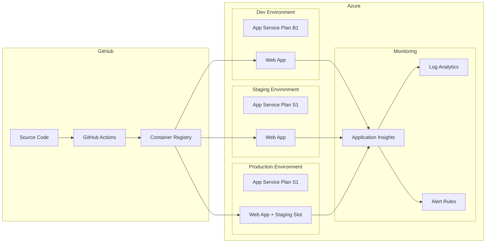

# Geins Studio Infrastructure

This directory contains the Infrastructure as Code (IaC) for deploying the Geins Studio application to Azure using Bicep templates.

## Quick Start

The fastest way to set up the infrastructure is to use the automated setup script:

```bash
# Full setup: resource groups, service principal, federated credentials
pnpm infra:setup

# Or run individual steps:
pnpm infra:setup:rg      # Create resource groups only
pnpm infra:setup:sp       # Create service principal only
pnpm infra:setup:creds    # Create federated credentials only
```

After running the setup script, follow the output instructions to add the required secrets to your GitHub repository.

## Architecture Overview



## Directory Structure

```
infra/
├── main.bicep                    # Main orchestration template
├── modules/
│   ├── appServicePlan.bicep      # App Service Plan module
│   ├── webApp.bicep              # Web App module
│   ├── applicationInsights.bicep # Application Insights & Log Analytics
│   └── alertRules.bicep          # Azure Monitor alert rules
├── parameters/
│   ├── dev.bicepparam            # Development parameters
│   ├── staging.bicepparam        # Staging parameters
│   └── prod.bicepparam           # Production parameters
├── scripts/
│   ├── setup.sh                  # Automated Azure setup script
│   ├── deploy.sh                 # Manual deployment script
│   └── validate.sh               # Template validation script
├── environment-variables.md      # Complete env vars reference
└── README.md                     # This file
```

> **Looking for environment variables?** See [environment-variables.md](./environment-variables.md) for the complete reference.

## Available Scripts

The following pnpm scripts are available for infrastructure management:

| Script                      | Description                                   |
| --------------------------- | --------------------------------------------- |
| `pnpm infra:setup`          | Full Azure setup (resource groups, SP, creds) |
| `pnpm infra:setup:rg`       | Create resource groups only                   |
| `pnpm infra:setup:sp`       | Create service principal only                 |
| `pnpm infra:setup:creds`    | Create federated credentials only             |
| `pnpm infra:deploy`         | Manual deployment (requires arguments)        |
| `pnpm infra:deploy:dev`     | Deploy to development (requires --image)      |
| `pnpm infra:deploy:staging` | Deploy to staging (requires --image)          |
| `pnpm infra:deploy:prod`    | Deploy to production (requires --image)       |
| `pnpm infra:validate`       | Validate Bicep syntax                         |
| `pnpm infra:validate:build` | Build Bicep to ARM JSON                       |

## Custom Domains

| Domain           | DNS Provider |
| ---------------- | ------------ |
| `litium.studio`  | Cloudflare   |
| `geins.studio`   | Cloudflare   |

## Prerequisites

### Required Tools

1. **Azure CLI**: Install from https://docs.microsoft.com/cli/azure/install-azure-cli
2. **Azure Subscription**: An active Azure subscription with sufficient permissions

### Authentication

Before running any scripts, authenticate with Azure:

```bash
# Login to Azure
az login

# Verify you're in the correct subscription
az account show

# (Optional) Switch subscription if needed
az account set --subscription <subscription-id>
```

## Deployment Flow

```
┌─────────────────────────────────────────────────────────────────────────┐
│                           GitHub Actions                                 │
├─────────────────────────────────────────────────────────────────────────┤
│                                                                          │
│   ┌─────────────┐     ┌─────────────┐     ┌─────────────┐              │
│   │ Push to any │────▶│   Build &   │────▶│   Push to   │              │
│   │   branch    │     │    Test     │     │    GHCR     │              │
│   └─────────────┘     └─────────────┘     └──────┬──────┘              │
│                                                   │                      │
│   ┌───────────────────────────────────────────────┘                     │
│   │                                                                      │
│   │  ┌────────────────────────────────┐                                 │
│   │  │         Production             │                                 │
│   │  │  push to main / manual trigger │                                 │
│   │  └──────────────┬─────────────────┘                                 │
│   │                  │                                                   │
│   │                  ▼                                                   │
│   │  ┌──────────────────────────────┐                                   │
│   │  │  Azure Production (S1 tier)  │                                   │
│   │  └──────────────┬───────────────┘                                   │
│   │                  │                                                   │
│   │          ┌───────▼────────┐                                         │
│   │          │   Slot Swap    │                                         │
│   │          │   (approval)   │                                         │
│   │          └────────────────┘                                         │
│   │                                                                      │
│   └──────────────────────────────────────────────────────────────────────│
└─────────────────────────────────────────────────────────────────────────┘
```

## Manual Deployment

### Using pnpm Scripts

```bash
# Deploy to production
pnpm infra:deploy:prod -- --image ghcr.io/geins-io/geins-studio:main

# Preview changes without deploying (what-if)
pnpm infra:deploy -- --env prod --image ghcr.io/geins-io/geins-studio:main --what-if
```

### Using Azure CLI Directly

```bash
az deployment group create \
  --resource-group rg-studio-prod \
  --template-file infra/main.bicep \
  --parameters infra/parameters/prod.bicepparam \
  --parameters containerImage="ghcr.io/geins-io/geins-studio:main" \
               ghcrUsername="<github-username>" \
               ghcrToken="<github-pat>"
```

### Validate Templates

```bash
# Validate Bicep syntax
pnpm infra:validate

# Build Bicep to ARM JSON
pnpm infra:validate:build

# What-if deployment (preview changes)
pnpm infra:validate -- --env dev
```

## Environment Configuration

### SKU Tiers by Environment

| Environment | App Service Plan | Instances | Features                    |
| ----------- | ---------------- | --------- | --------------------------- |
| Production  | S1 (Standard)    | 1         | Staging slot for blue-green |

## Environment Variables

> See [environment-variables.md](./environment-variables.md) for the complete reference.

### Quick Summary

| Where              | What to Set                                                    |
| ------------------ | -------------------------------------------------------------- |
| **GitHub Secrets** | `AZURE_CLIENT_ID`, `AZURE_TENANT_ID`, `AZURE_SUBSCRIPTION_ID`, `AUTH_SECRET`, `GEINS_API_URL` |
| **GitHub Variables**| `BASE_URL`, `AUTH_PATH`, `GEINS_DEBUG`, `LOG_LEVEL`           |
| **Azure App Service**| Do not set manually - Bicep handles this automatically       |

## Monitoring & Alerting

The infrastructure includes comprehensive monitoring through Azure Application Insights and Log Analytics.

### Components

| Component            | Description                                    |
| -------------------- | ---------------------------------------------- |
| Application Insights | APM, telemetry, and error tracking             |
| Log Analytics        | Centralized log storage and querying           |
| Availability Tests   | Ping endpoint monitoring from multiple regions |
| Alert Rules          | Proactive notifications for issues             |

### Alert Rules

| Alert               | Threshold | Severity | Description                  |
| ------------------- | --------- | -------- | ---------------------------- |
| High Response Time  | > 2s      | Warning  | Average server response time |
| High Failure Rate   | > 5%      | Error    | Request failure percentage   |
| Server Errors       | > 3       | Critical | 5xx error count in 5 minutes |
| High CPU            | > 80%     | Warning  | CPU utilization              |
| High Memory         | > 80%     | Warning  | Memory utilization           |
| Availability Failed | < 80%     | Critical | Health check availability    |

### Log Retention & Data Caps

| Environment | Retention | Daily Cap | Purpose                        |
| ----------- | --------- | --------- | ------------------------------ |
| Production  | 90 days   | 10 GB     | Compliance and troubleshooting |

### Disabling Monitoring

To disable monitoring (e.g., for cost savings in dev), set `enableMonitoring` to `false`:

```bash
az deployment group create \
  --parameters enableMonitoring=false
```

## Security Considerations

1. **Managed Identity**: Each Web App has a system-assigned managed identity for secure Azure resource access
2. **HTTPS Only**: All Web Apps enforce HTTPS
3. **TLS 1.2+**: Minimum TLS version is 1.2
4. **FTPS Disabled**: FTP/FTPS is disabled for security
5. **Non-root Container**: The Docker container runs as a non-root user
6. **Secrets in Azure**: Sensitive values are stored as App Service application settings (encrypted at rest)
7. **OIDC Authentication**: GitHub Actions use OIDC (federated credentials) - no secrets stored in GitHub

## Cost Optimization

| Environment | Estimated Monthly Cost | Notes                 |
| ----------- | ---------------------- | --------------------- |
| Production  | ~$73/month             | S1 tier, staging slot |

**Cost Saving Tips:**

- Use Azure Reserved Instances for production workloads (up to 65% savings)
- Shut down dev environment during non-working hours
- Use Azure Cost Management to set budgets and alerts
